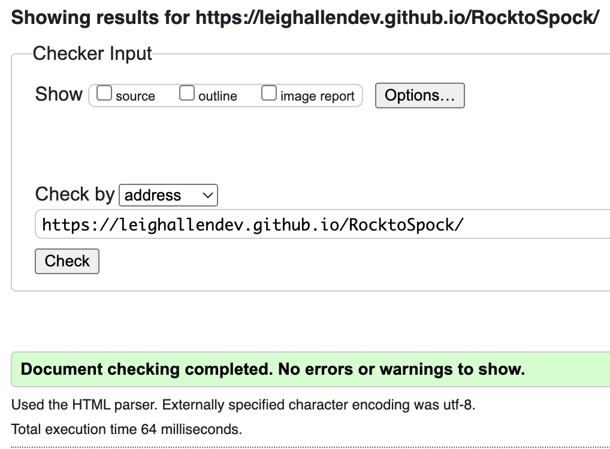
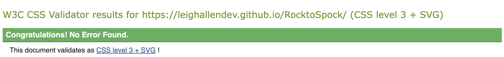

# Rock to Spock!

**Code Institute** Learner Project 02

## Site Overview

Rock to Spock is my take on the classic Rock, Paper, Scissors game with the added rules from the popular TV show: **The Big Bang Theory**

The aim of the site is to allow the user to play Rock, Paper, Scissors, Lizard, Spock agaianst the Computer to determine the winner of the game, the first to reach the score limit of 10 Wins!.

### The Rules

The rules of the game are as follows: 
- Rock crushes Scissors
- Scissors cuts Paper
- Paper covers Rock
- Rock crushes Lizard
- Lizard poisons Spock
- Spock smashes Scissors
- Scissors decapetate Lizard
- Lizard eats Paper
- Paper disproves Spock
- Spock vaporizes Rock

### Technologies and Challenges
For this project I used a combination of HTML, CSS and JavaScript for the design and functionality of this game. This is my first project using JavaScript and it came with many challenges but overall I'm proud of the result. 

During this project, I faced issues with the JavaScript just not working which is explained in further detail in the testing section. I also had to watch many tutorials to get explanations of why functions weren't behaving the way I had hoped.

A future implementation I would like to achieve with this project is to make it playable between two users as an option rather than just playing against the computer.

# Table of Contents
1. [Site Overview](#site-overview)
2. [Planning Stage](#planning-stage)
	* [Target Audience](#target-audience)
 	* [Site Aims](#site-aims)
	* [Colour Scheme](#colour-scheme)
	* [Typography](#typography)
3. [Current Features](#current-features)
	* [Game Features](#game-functionality)
	* [Site Features](#site-features)
4. [Future Enhancements](#future-enhancements)
5. [Testing Phase](#testing-phase)
6. [Deployment](#deployment)
7. [Technologies](#technologies)
8. [Credits](#credits)
	* [Honorable Mentions](#honorable-mentions)
	* [General Reference](#general-reference)
	* [Content](#content)
	* [Media](#media)

## Planning Stage

### Target Audience
The target audience of this site is:
* People that like to play games against the computer on the internet without the need for friends.
* People that enjoy The Big Bang Theory.
* People that like the game Rock Paper Scissors.

### Site Aims
The site aims to give the user the ability to play Rock Paper Scissors Lizard Spock whenever they feel like playing.

### Colour Scheme
The colour scheme I chose for this site was created by an auto-generator on the Coolors app, which is an app, and website that will generate considered colours that work well together. 

The colours I used for the overall site as generated by the app are: 
	
* Charcoal
	- `#364256`
	- `rgb(54, 65, 86)`
* Oxford Blue
	- `#011638`
	- `rgb(1, 22, 56)`
* Light Gray
	- `#CDCDCD`
	- `rgb(205, 205, 205)`
* Honeydew
	- `#DFF8EB`
	- `rgb(223, 248, 235)`
* Brunswick Green
	- `#214E34`
	- `rgb(33, 78, 52)`

Additionally, I used extra colours for the borders of the buttons to indicate whether the player won, lost or drew, these colours are:

* Red
	- `#fc121b`
	- `#d01115`
* Green
	- `#4dcc7d`
	- `#31b43a`
* Gray
	- `#464647`
	- `#25292b`

Each colour has a slightly different shade to look as if the icons border is glowing.

### Typography

For the project I used the font Press Start 2P which I found while searching on [Google Fonts](https://fonts.google.com/). I chose this font as it has reminds me of a retro game design which seemed fitting for my first more gamified project.

I used the same font across the website for added consistency as it makes for a more uniform design.

## Current Features

### Game Functionality
The game currently gives the user the ability to play against the computer and the first to reach the score limit of 10 wins the game.

The computer functionality is achieved with a random number generator function which asigns a number between 1 and 5 to one of the 5 available choices.

When the user makes a selection a message pops up to identify whether they win or loose the round. The score is then updated and it counts up to 10 for either the player or the computer.

When the game is over a button will appear to ask the player of they would like to play again.

### Site Features
The site uses a common colour scheme and the same font across all elements for consistancy and to improve the user experience. 

The icons were found on [Flaticon](https://www.flaticon.com) when searching for hand gestures, the lizard icon was rotated, but the rest of the hands are their original designs. 

The icons I used were: 
* Rocker
* Hand-up
* Scissors
* Italian
* Star-Trek

When the user makes a choice there is a pop up message to let them know whether they win, draw or loose, as well as text to describe the outcome and what the computer picked. This was achieved with the help of Sweet Alerts, more information can be found in the Credits section.

## Future Enhancements
Although this project functions as much as it needs to for the project requirements, there are a few enhancements I would like to achieve in the future. 

These enhancements are:
* The ability to play against another player rather than the computer, this could be achieved by making it a turn based game and having the functions to determine which user answer would win, similar to how it currently functions.
* The ability to change the score limit to give users more flexibility rather than a fixed limit of 10. For example some users may only want to play 10 rounds, or score a total of 5.
* Eventually I would like to make the site be able to give specific messages depending on the outcome of the round, for example *Paper Disproves Spock* rather than *Paper beats Spock*.

## Testing Phase
There has been extensive testing to this site and it has not been built without it's challenges. I have overcome a number of issues with this site while trying to perfect it. However, there are still a few bugs which are yet to be ironed out.

I needed to test the functionality and design of this website very early on in the creative process, so I deployed it on GitHub pages during the development process, this allowed me to not only test it on my MacBook Air, but also an iPhone 14 Pro, a couple of android phones and my iPad Air.

It took a lot of work to make the site look how I wanted it to on a small devices while keeping it looking how I expected it on larger devices.

I have tested my project on some offical validators.

Nu HTML Checker:

W3C CSS Validator:

Lighthouse:

#### Issues
One issue I faced with this project was getting the JS script to work on the webpage. This was resolved with the help of my Mentor who informed me that I needed to start the link with ./ rather than just the file name. 

During the testing phase it turned out that the buttons were spam-clickable, this was affecting the results table and breaking the game after 5 turns. This was fixed by adding a function that disabled the buttons for 1500ms and then re-enabled them again.

There was a bug in my code due to 2 of the possible outcomes being typos or missing, this caused the game to stop working. This, again was picked up by my Mentor and I was able to add the missing outcomes into the code which prevented this issue from happening again. 

### Bugs
If you find a bug in my code please let me know! This is my first JS project so I wouldn't be surprised if there are some.

A known bug is the responsiveness of the site. I have tested this site on 4 smartphones and the icons have appeared slightly missaligned on each of them at different times. 

I have tested this site on AmIResponsive and it shows up differently on that than it does on any device I've tested it with.

## Deployment
I deployed my site onto **GitHub Pages** using the following steps:
1. Open GitHub projects repository and click on the **Settings** tab at the top.
2. In the menu on the left side of the page, select the **Pages** tab.
3. Under **Build and Development**, Select **Main** from the **Source** dropdown menu then click **Save**.
4. Once completing these steps, a message is displayed confirming **Successful Deployment**

The live website can be found by following the URL - https://leighAllenDev.github.io/RocktoSpock

## Technologies
This entire project was built using 3 programming languages:
* HTML - HyperText Mark-up Language
* CSS - Cascading Style Sheets
* JavaScript

The Project was built with VS Code and the repository hosted by GitHub

## Credits

### Honorable Mentions
My Mentor for my Code Institute course, Richard Wells has been a great help during this project with debugging and general advice.

I would also have to mention my class mates on Slack who have been really helpful during this course so far.

### General Reference
To complete this project I watched a few youtube tutorials, one specifically that helped is the Rock Paper Scissors tutorial with FreeCodeCamp:

 [JavaScript, HTML, CSS - Rock Paper Scissors Game](https://www.youtube.com/watch?v=jaVNP3nIAv0)

This tutorial inspired a lot of the workings of my site so credit goes to them for this project. 

Another site I found extremely helpful for this project was **Stack Overflow**. Specifically this article [Stack OverFlow - JavaScript Endgame](https://stackoverflow.com/questions/64283015/vanilla-javascript-end-game-when-player-reaches-a-certain-score)

For this project I also relied on MDN Webdocs and w3Schools.

## Content
The font used for this site is 'Press Start 2P' from GoogleFonts

Code snipets potentially from slack, stack overflow and FreeCodeCamp

The pop up alerts when the user clicks a hand are generated with the help of Sweet alerts, a javaScript library that has a plethora of different functions and snipets on it. [Sweet Alert](https://sweetalert2.github.io/#examples)

### Media

**Flaticon Icons**

Rock: 

Rocker icons created by Eucalyp - Flaticon https://www.flaticon.com/free-icons/rocker

Paper:

Hand up icons created by Freepik - Flaticon  
https://www.flaticon.com/free-icons/hand-up

Scissors:

Scissors icons created by Freepik - Flaticon  
https://www.flaticon.com/free-icons/scissors

Lizard:

Italian icons created by Paul J. - Flaticon  
https://www.flaticon.com/free-icons/italian

Spock:

Star trek icons created by Freepik - Flaticon  
https://www.flaticon.com/free-icons/star-trek
